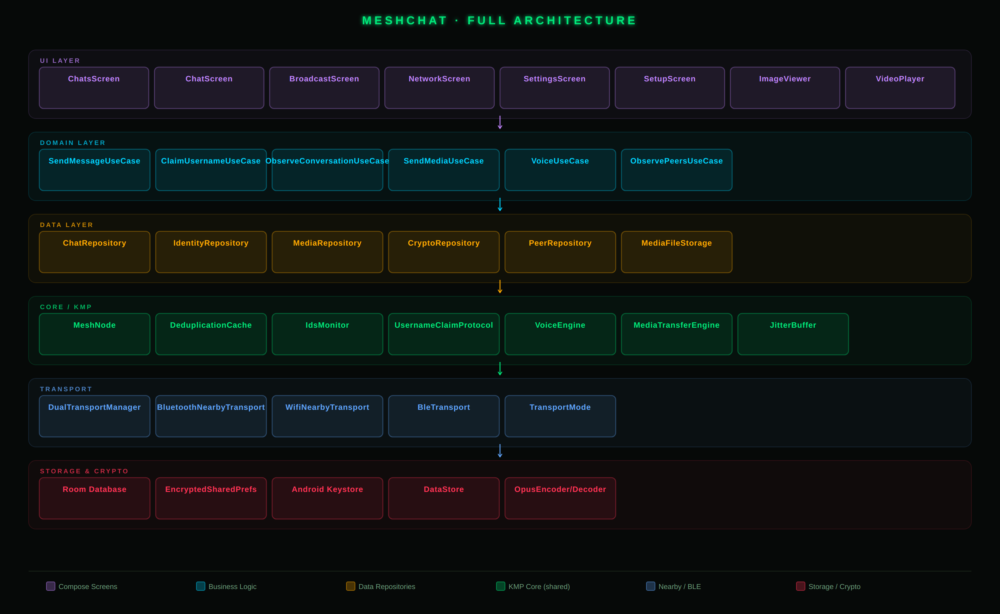
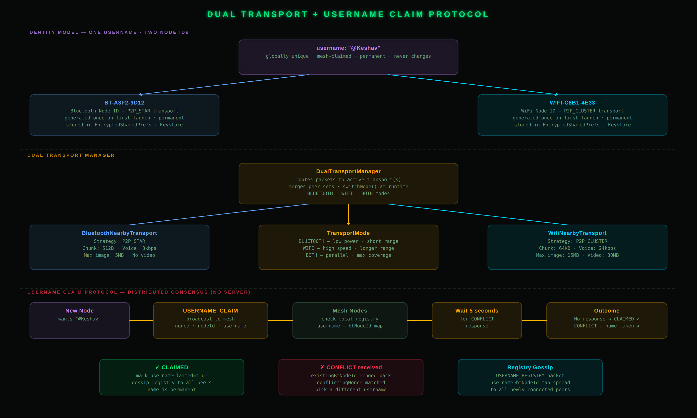
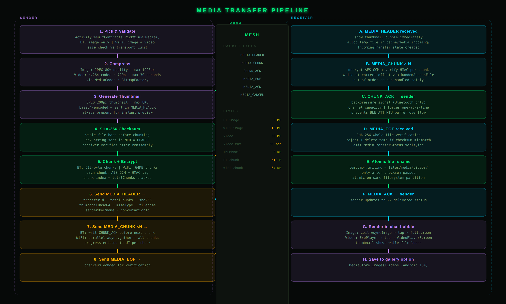
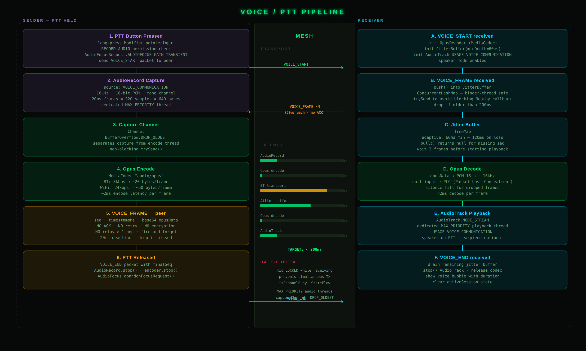
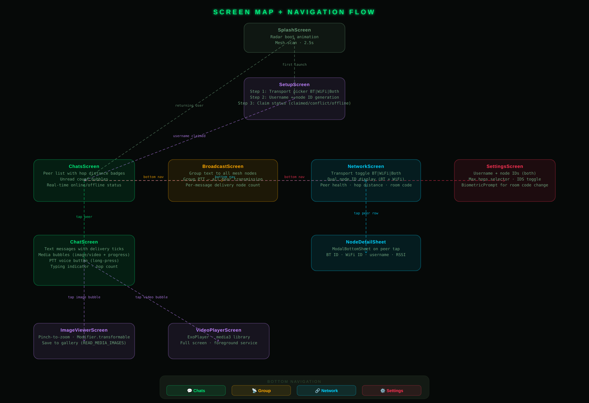
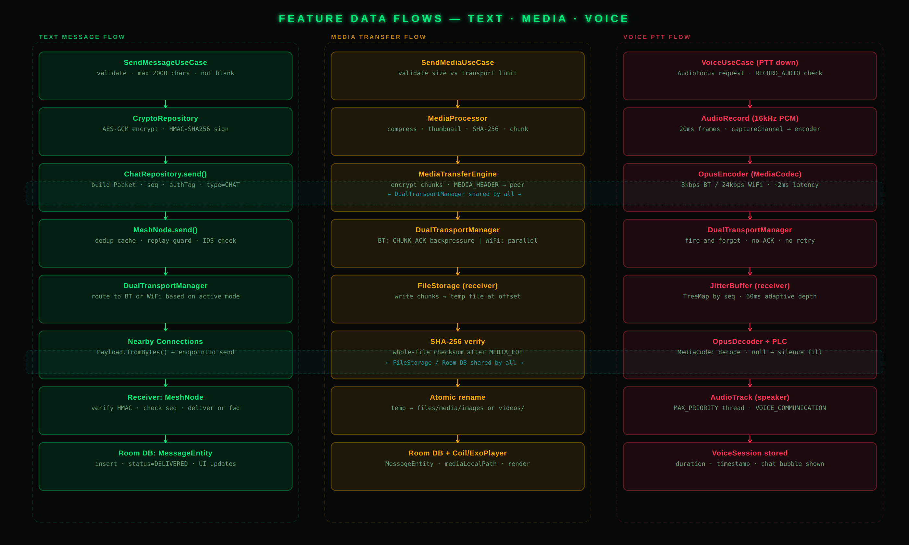

# 🌐 MeshChat


> **100% offline, peer-to-peer encrypted mesh communication** — text, images, video, and real-time voice over Bluetooth & Wi-Fi Direct. No internet. No servers. No accounts.

MeshChat is a decentralized, offline-first communication platform built for Android. It uses Google's **Nearby Connections API** to form a self-healing P2P mesh network across Bluetooth and Wi-Fi Direct, allowing devices to communicate without any cellular data, Wi-Fi routers, or internet access.

---

## ✨ Key Features

| Feature | Details |
|---|---|
| **100% Offline** | Works in zero-connectivity environments — disaster zones, remote locations, crowded events |
| **Dual Transport** | Simultaneous Bluetooth (P2P_STAR) and Wi-Fi Direct (P2P_CLUSTER) — switchable at runtime |
| **Multi-Hop Routing** | Messages hop across intermediate devices to reach out-of-range peers |
| **End-to-End Encryption** | AES-256-GCM encryption + HMAC-SHA256 authentication on every packet |
| **Secure Username Identity** | Distributed consensus claim protocol — no server, no central registry |
| **Image & Video Transfer** | Chunked, encrypted, backpressure-controlled media transfers with integrity verification |
| **Real-Time Voice PTT** | Walkie-talkie Push-To-Talk with Opus codec, adaptive jitter buffer, < 200ms latency |
| **Intrusion Detection (IDS)** | Built-in anomaly detection for replay attacks, rate flooding, and hop-limit violations |
| **Modern Compose UI** | Material Design 3, animated overlays, progress bubbles, media viewer |

---

## 🏗️ Architecture

### Full System Overview



MeshChat follows strict **Clean Architecture** principles with a modular multi-layer design:

| Module | Role |
|---|---|
| **`:app`** | Jetpack Compose UI, ViewModels, navigation |
| **`:core`** | `MeshNode` router — multi-hop routing, deduplication, IDS, identity, voice/media bridges |
| **`:data`** | Room database, repository implementations, crypto, media engine |
| **`:domain`** | Pure Kotlin models and UseCases — zero Android dependencies |
| **`:transports`** | Physical transport layer via Google Nearby Connections API |

---

### Dual Transport + Username Claim Protocol



Each user has **one permanent username** and **two permanent node IDs** (BT + WiFi), generated once on first launch and stored securely in `EncryptedSharedPreferences` + Android Keystore.

- **BluetoothNearbyTransport** — P2P_STAR, 512-byte chunks, max 5 MB image, no video
- **WifiNearbyTransport** — P2P_CLUSTER, 64 KB chunks, max 15 MB image, 30 MB video
- **DualTransportManager** — routes packets to the active transport(s), merges peer sets, supports runtime switching between `BLUETOOTH | WIFI | BOTH` modes

Username claiming uses **distributed consensus** — no server required. A `USERNAME_CLAIM` broadcast is sent with a nonce; if no `CONFLICT` response arrives within 5 seconds, the name is permanently claimed and gossiped via `USERNAME_REGISTRY` packets to all future peers.

---

### Media Transfer Pipeline



Images and videos are transferred using a **6-packet protocol** (`MEDIA_HEADER → MEDIA_CHUNK ×N → MEDIA_EOF → MEDIA_ACK`) with the following guarantees:

- **Per-chunk AES-256-GCM encryption** + HMAC verification — no plaintext on the wire
- **Backpressure flow control** on Bluetooth — `CHUNK_ACK` forces one-at-a-time delivery to prevent BLE ATT MTU buffer overflow
- **Out-of-order chunk reassembly** via `RandomAccessFile` position writes
- **SHA-256 whole-file checksum** verified on receipt before atomic rename from temp → permanent storage
- **Transport-adaptive limits**: BT image ≤ 5 MB (512 B chunks), WiFi image ≤ 15 MB (64 KB chunks), video ≤ 30 MB / 30 seconds (WiFi only)

---

### Voice / PTT Pipeline



Real-time half-duplex voice using a walkie-talkie Push-To-Talk model:

- **20 ms Opus frames** captured at 16 kHz PCM mono via `AudioRecord` on a `MAX_PRIORITY` thread
- **Opus codec** via MediaCodec: 8 kbps on Bluetooth, 24 kbps on WiFi — ~2 ms encode latency
- **Fire-and-forget delivery** — no ACK, no retry, no encryption — optimised for latency
- **Adaptive JitterBuffer** (`TreeMap` by sequence) — 60–120 ms adaptive depth, Packet Loss Concealment (PLC) for dropped frames
- **AudioTrack playback** in `USAGE_VOICE_COMMUNICATION` mode on a dedicated `MAX_PRIORITY` thread
- **End-to-end target latency < 200 ms** including BT transport
- **Half-duplex guard** — mic is locked while receiving; `isChannelBusy` StateFlow prevents simultaneous TX

---

## 📱 Screen Map & Navigation



| Screen | Purpose |
|---|---|
| **SplashScreen** | Radar boot animation (2.5 s) |
| **SetupScreen** | 3-step wizard: transport picker → username claim → consensus result |
| **ChatsScreen** | Peer list with hop distance badges and online/offline status |
| **ChatScreen** | DM conversation with text, media bubbles, PTT voice button |
| **BroadcastScreen** | Group text to all mesh nodes + group PTT |
| **NetworkScreen** | Transport toggle, dual-ID display, peer health & room code |
| **SettingsScreen** | Identity card, max hops, IDS toggle, biometric-gated room code |
| **ImageViewerScreen** | Pinch-to-zoom full-screen viewer, save to gallery |
| **VideoPlayerScreen** | ExoPlayer full-screen playback |

---

## 🔄 Feature Data Flows



Three parallel data pipelines share the same `DualTransportManager` and storage layer:

**Text Message:** `SendMessageUseCase` → AES-GCM encrypt → `ChatRepository.send()` → `MeshNode` (dedup + IDS) → `DualTransportManager` → Nearby → receiver `MeshNode` → HMAC verify → `Room DB`

**Media Transfer:** `SendMediaUseCase` → `MediaProcessor` (compress/thumbnail/SHA-256/chunk) → `MediaTransferEngine` (encrypt chunks) → `DualTransportManager` (BT: backpressure; WiFi: parallel) → receiver FileStorage → SHA-256 verify → atomic rename → `Room DB` + `Coil/ExoPlayer`

**Voice PTT:** `VoiceUseCase` → `AudioRecord` (16kHz PCM) → `OpusEncoder` → `DualTransportManager` (fire-and-forget) → receiver `JitterBuffer` → `OpusDecoder` (+ PLC) → `AudioTrack`

---

## 🚀 Getting Started

### Prerequisites

- [Android Studio](https://developer.android.com/studio) Giraffe or newer
- **JDK 17**
- **Android SDK 34** (Min SDK 24 / API 29+)
- **Two or more physical Android devices** (emulators do not support Bluetooth / Wi-Fi Direct hardware)

### Build & Install

```bash
# Clone
git clone https://github.com/Keshav-gehlot/Bluetooth-based-communication-network.git
cd Bluetooth-based-communication-network

# Build debug APK
./gradlew assembleDebug

# APK output
# app/build/outputs/apk/debug/app-debug.apk
```

Or open the project in Android Studio and click **Run ▶**.

### Runtime Permissions

The app requests the following at runtime:

| Permission | Reason |
|---|---|
| `BLUETOOTH_SCAN` / `BLUETOOTH_ADVERTISE` / `BLUETOOTH_CONNECT` | BLE peer discovery & connections (API 31+) |
| `ACCESS_FINE_LOCATION` | Required by Android for Nearby Connections |
| `NEARBY_WIFI_DEVICES` | Wi-Fi Direct peer discovery (API 33+) |
| `RECORD_AUDIO` | Voice PTT capture |
| `READ_MEDIA_IMAGES` / `READ_MEDIA_VIDEO` | Image & video picker (API 33+) |

---

## 🔐 Security Model

- **AES-256-GCM** symmetric encryption for all chat and media payloads
- **HMAC-SHA256** authentication tag per media chunk — prevents chunk injection/substitution
- **SHA-256 whole-file checksum** verified before media is saved — prevents corrupted or tampered transfers
- **Android Keystore** backed key storage — keys never leave secure hardware
- **Username claim nonce** prevents replay-based username hijacking
- **IDS Monitor** — rate limits, replay-window deduplication, hop-limit enforcement

---

## 🛠️ Tech Stack

| Category | Library / Technology |
|---|---|
| Language | Kotlin (Multiplatform core) |
| UI | Jetpack Compose, Material Design 3 |
| Concurrency | Kotlin Coroutines, StateFlow, SharedFlow, Channels |
| DI | Dagger Hilt |
| Database | Room (WAL mode) |
| P2P Transport | Google Nearby Connections API |
| Media Codec | Android MediaCodec (Opus), BitmapFactory, ExoPlayer |
| Image Loading | Coil |
| Crypto | Android Keystore, `javax.crypto` AES-GCM |
| Serialization | kotlinx.serialization |
| Logging | Timber |

---

## 🤝 Contributing

1. Fork the project
2. Create your feature branch: `git checkout -b feature/AmazingFeature`
3. Commit your changes: `git commit -m 'Add AmazingFeature'`
4. Push to the branch: `git push origin feature/AmazingFeature`
5. Open a Pull Request

---

## 📝 License

This project is open-source and available under the terms of the **MIT License**. See the [LICENSE](LICENSE) file for details.