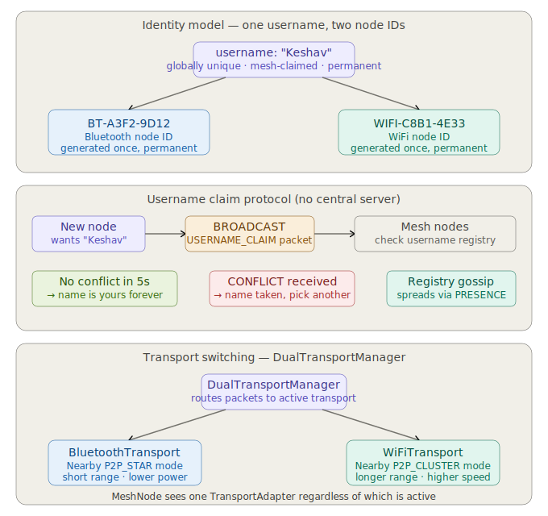
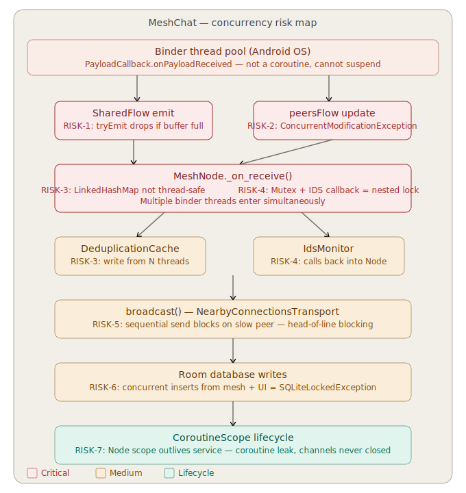

# 🌐 MeshChat


MeshChat is a highly resilient, decentralized, offline-first communication platform built for Android. It leverages Google's **Nearby Connections API** to create a peer-to-peer (P2P) mesh network using Bluetooth and Wi-Fi Direct, allowing devices to communicate seamlessly without relying on cellular data, Wi-Fi routers, or the internet.

---

## ✨ Key Features

*   **100% Offline Communication:** Communicate in environments with zero internet access, such as remote locations, disaster zones, or crowded events.
*   **Decentralized Mesh Networking:** Devices automatically discover each other, negotiate connections, and form a self-healing mesh topology dynamically.
*   **Multi-Hop Message Routing:** Messages can intelligently hop across intermediate devices to reach peers that are out of direct Bluetooth range, effectively extending the network's physical reach.
*   **End-to-End Encryption (E2EE):** Secure communication using robust cryptographic standards (AES-GCM/RSA) to ensure total privacy across the decentralized network.
*   **Direct & Broadcast Messaging:** Support for one-on-one direct messages and multi-user broadcast chat rooms.
*   **Intrusion Detection System (IDS):** Built-in traffic monitoring to detect anomalies, network flooding, and suspicious routing behavior to keep the mesh safe.
*   **Modern UI:** Built fully with **Jetpack Compose** featuring a beautiful, fluid Material Design 3 interface.

---

## 📸 Screenshots

*(Add your application screenshots here)*
<div style="display: flex; gap: 10px;">
  
  
  
</div>

---

## 🚀 Getting Started

### Prerequisites

To build and run this project, you need:
*   [Android Studio](https://developer.android.com/studio) (Giraffe or newer recommended)
*   **Java Development Kit (JDK) 17**
*   **Android SDK 34** (Minimum SDK 24)

### Installation

1.  **Clone the repository:**
    ```bash
    git clone https://github.com/Keshav-gehlot/Bluetooth-based-communication-network.git
    cd Bluetooth-based-communication-network
    ```
2.  **Open in Android Studio:**
    Open the cloned directory in Android Studio. Let Gradle sync and download all necessary dependencies.
3.  **Build the Project:**
    Click the **Run** button or execute the following Gradle command:
    ```bash
    ./gradlew assembleDebug
    ```

### Running the App

To actually test the mesh networking capabilities, **you must install the app on at least two physical Android devices**. Emulators do not fully support the Bluetooth and Wi-Fi Direct hardware requirements for the Nearby Connections API.

**Permissions Required at Runtime:**
*   Bluetooth & Bluetooth LE (Scanning, Advertising, Connecting)
*   Wi-Fi (Nearby Wi-Fi Devices)
*   Precise Location (Required by Android for hardware discovery)

---

## 🏗️ Architecture & Tech Stack



MeshChat adheres to strict **Clean Architecture** principles and uses modern Android development standards. The project is modularized into several layers:

*   **`app` (Presentation):** Contains the Jetpack Compose UI, ViewModels, and navigation logic.
*   **`core` (Mesh Engine):** Contains the `MeshNode` router, which handles multi-hop packet routing, message deduplication, presence management, and anomaly detection. 
*   **`data` (Persistence):** Handles local persistence using Room (configured with Write-Ahead Logging for high concurrency), repository implementations, and cryptographic abstractions.
*   **`domain` (Business Logic):** Pure Kotlin models and UseCases governing the business logic of the messaging network.
*   **`transports` (Hardware Layer):** Implements the physical transport protocols. Currently backed by Google's Nearby Connections API.

### Technologies & Libraries
*   **Language:** Kotlin
*   **UI Framework:** Jetpack Compose (Material 3)
*   **Concurrency:** Kotlin Coroutines & StateFlow/SharedFlow
*   **Dependency Injection:** Dagger Hilt
*   **Local Database:** Room (SQLite)
*   **P2P Framework:** Google Nearby Connections API
*   **Logging:** Timber

---

## 🛠️ Concurrency & Resilience



The mesh network relies heavily on asynchronous operations. MeshChat incorporates hardened concurrency patterns to prevent deadlocks and network blockages:
*   **Parallel Fan-Outs:** Broadcasts and packet forwarding are fanned out asynchronously with strict coroutine timeouts (`withTimeout`), ensuring that a slow or disconnected peer cannot bottleneck the rest of the network.
*   **Reactive Pipelines:** Data and anomaly events stream through non-blocking Kotlin `Channels` bridging background binder threads safely into the Coroutine world.
*   **Thread-Safe State:** Internal network graphs and peer listings use `ConcurrentHashMap` and thread-safe Mutexes to prevent `ConcurrentModificationException` crashes under heavy load.

---

## 🤝 Contributing

Contributions are what make the open-source community such an amazing place to learn, inspire, and create. Any contributions you make are **greatly appreciated**.

1. Fork the Project
2. Create your Feature Branch (`git checkout -b feature/AmazingFeature`)
3. Commit your Changes (`git commit -m 'Add some AmazingFeature'`)
4. Push to the Branch (`git push origin feature/AmazingFeature`)
5. Open a Pull Request

---

## 📝 License

This project is open-source and available under the terms of the MIT License. See the [LICENSE](LICENSE) file for details.